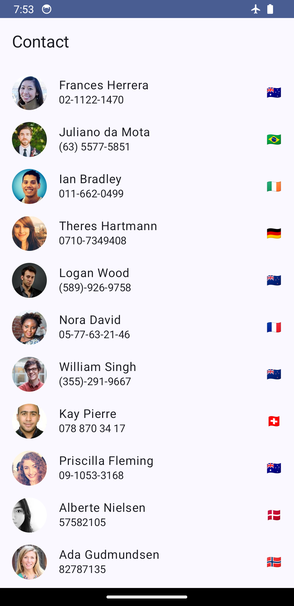
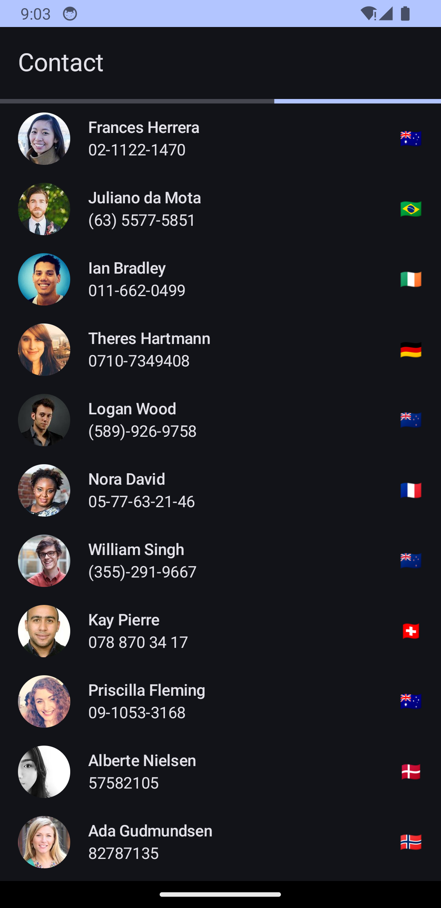
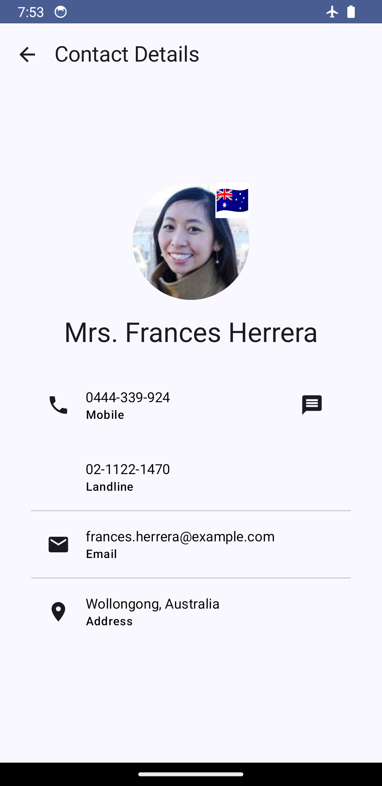
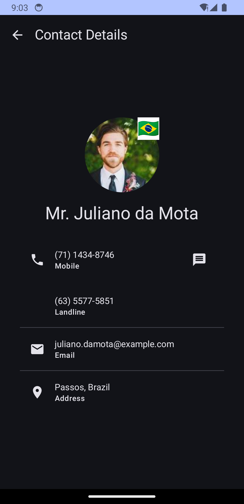

# Simple Contact App

This is a simple contact app that demonstrates modern Android development practices using:

* **Retrofit:** For fetching contact data from theRandom User API (https://randomuser.me/).
* **Room:** For persisting contact data in a local database.
* **Jetpack Compose:** For building a declarative UI to display and interact with contacts.
* **Hilt:** For dependency injection.

## Features

* Fetches a list of contacts from the Random User API.
* Stores the fetched contacts in a Room database.
* Displays the list of contacts in a scrollable list.
* Shows contact details when a contact is selected.
* Includes unit and instrumented tests.

## Architecture

The app follows a Model-View-ViewModel (MVVM) architecture:

* **Model:** Represents the contact data and data access objects (DAOs).
* **View:** Jetpack Compose functions that display the UI and handle user interactions.
* **ViewModel:**  Manages the UI state, interacts with the repository, and provides data to theView.

## Libraries and Components Used

* **Retrofit:** For making network requests.
* **Gson:** For parsing JSON responses.
* **Room:** For local data persistence.
* **Jetpack Compose:** For building the UI.
* **ViewModel:** For managing UI state.
* **Hilt:** For dependency injection.
* **Coroutines:** For asynchronous operations.
* **Hilt Flow:**  Integrates Kotlin Flows with Hilt to provide a streamlined way to inject Flow instances. Used for observing data changes from the repository.
* **Navigation Compose:** For navigating between different screens in the app (contact list and contact details).
* **JUnit:** For unit testing.
* **MockK:** A mocking library for Kotlin, used for creating mocks and stubs in unit tests.
* **Turbine:** A small testing library for Kotlin Flows, used for testing flow emissions in a more structured way.

## Running the App

1. Clone the repository.
2. Open the project in Android Studio.
3. Build and run the app on an emulator or device.

## Testing

* **Unit Tests:** Located in the `src/test/java` directory.
* **Instrumented Tests:** Located in the `src/androidTest/java` directory.
* **Shared Test Code:** Located in the `shared-code-tests` module.

Run tests from Android Studio or using the command line.

## Screenshots

Located in the `screenshots` directory.

[](screenshots/contacts.png)
[](screenshots/contacts_dark.png)
[](screenshots/contact_details.png)
[](screenshots/contact_details_dark.png)

## Future Improvements

* Filter contact list.
* Improve UI design and user experience.
* Add contact editing and deletion.
* Add more comprehensive tests.

### License


```
Copyright 2022 Google, Inc.

Licensed to the Apache Software Foundation (ASF) under one or more contributor
license agreements. See the NOTICE file distributed with this work for
additional information regarding copyright ownership. The ASF licenses this
file to you under the Apache License, Version 2.0 (the "License"); you may not
use this file except in compliance with the License. You may obtain a copy of
the License at

http://www.apache.org/licenses/LICENSE-2.0

Unless required by applicable law or agreed to in writing, software
distributed under the License is distributed on an "AS IS" BASIS, WITHOUT
WARRANTIES OR CONDITIONS OF ANY KIND, either express or implied. See the
License for the specific language governing permissions and limitations under
the License.
```
